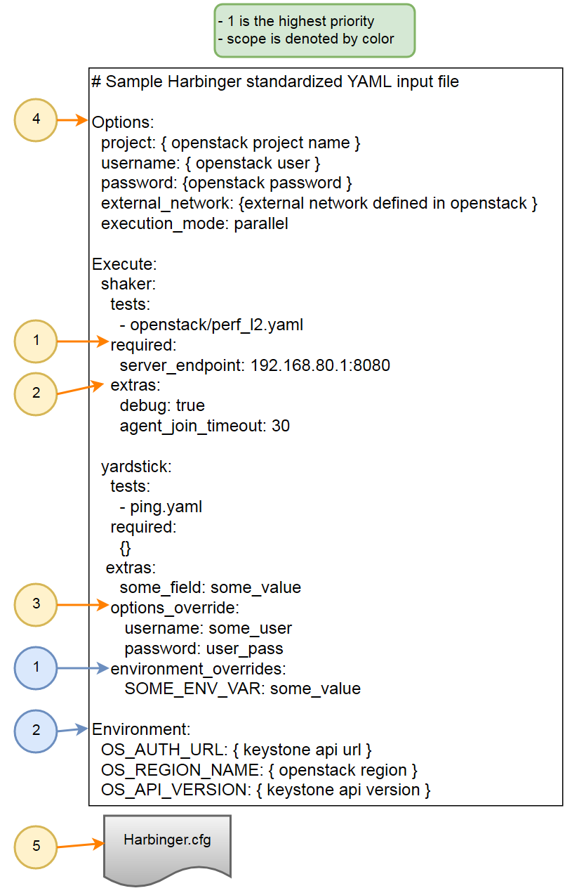

=================================================================
How to use
=================================================================

Run Docker Container (Linux)
^^^^^^^^^^^^^^^^^^^^^^^^^^^^

1) Create a docker image
    docker build -t harbinger .
2) Run a container from the docker image
    docker run -tid --privileged -v $PWD:/home/share --name harbinger --net host harbinger bash
      *--privileged is recommeneded by some frameworks like Yardstick in order to correctly build images*
3) Enter the container
    docker exec -it harbinger bash

Setup YAML file
^^^^^^^^^^^^^^^
In order to create a valid yaml file, three blocks are required. A sample input file is provided in the Harbinger repo

1) Options
    Harbinger global options

    - project *(name of the openstack project to use)*
    - username *(openstack user)*
    - password *(openstack password)*
    - execution_mode  *(serial or parallel[default])*

2) Environment
    specify which environment you want to test against

    - OS_AUTH_URL *(keystone url)*
    - OS_REGION_NAME *(openstack region)*
    - OS_API_VERSION *(keystone api version)*
    - EXTERNAL_NETWORK *(network defined as external in openstack)*

3) Execute
    specify which frameworks you want to run, and which tests for those frameworks you would want to run.

    - tests: *(a directory or list of tests to execute [both absolute and relative {to framework} paths are allowed)*
    - required: *(fields that are required by target framework e.g. server_endpoint in shaker)*
    - extras: *(extra fields that are supported by target framework, refer to target framework docs)*
    - options_override: *(overrides settings in Options block)*
    - environment_override: *(overrides settings in Environment block)*

section/option priorities
    Each section has a priority level the highest being 1. Meaning a section or option that is of priority 1 will take
    precedence over other priorities

    An example of this being usefull is if you set a user in the Options section, but want a framework to
    rely on different user (with perhaps different creds), you can specify a different user in the options_override for that framework

    Since options_override is a higher priority it will consider those values over the ones specified in the Options section

    The lowest priority will always be default values provided for the target framework in etc/harbinger.cfg

    The diagram below shows the priority level for each section or option using the sample standardized input yaml file

----------------
Priority example
----------------

Run Harbinger
^^^^^^^^^^^^^
Now you can run Harbinger by passing in the yaml file to the run command

**harbinger run <location of standardized yaml file>**
   *inside the container the alias 'hrb' can be used to execute harbinger commands*

Harbinger File Structure
^^^^^^^^^^^^^^^^^^^^^^^^
This shows an example of Harbinger's file structure in the docker container

Harbinger's source  can be found in /opt/harbinger-src

The default location for results file would be /opt/harbinger/outputs
::

    /opt/harbinger/
    ├── frameworks
    │   ├── shaker
    │   └── yardstick
    ├── inputs
    │   ├── shaker.cfg
    │   ├── yardstick.conf
    │   └── yardstick-suite.yaml
    ├── outputs
    │   ├── archive-hrb.log
    │   ├── shaker-results-149a2-hrb.json
    │   ├── shaker-results-e37c7-hrb.json
    │   ├── shaker-results.json
    │   ├── yardstick-68462-hrb.out
    │   ├── yardstick-82a33-hrb.out
    │   └── yardstick-f3dd8-hrb.out
    └── venvs
        ├── shaker
        └── yardstick
