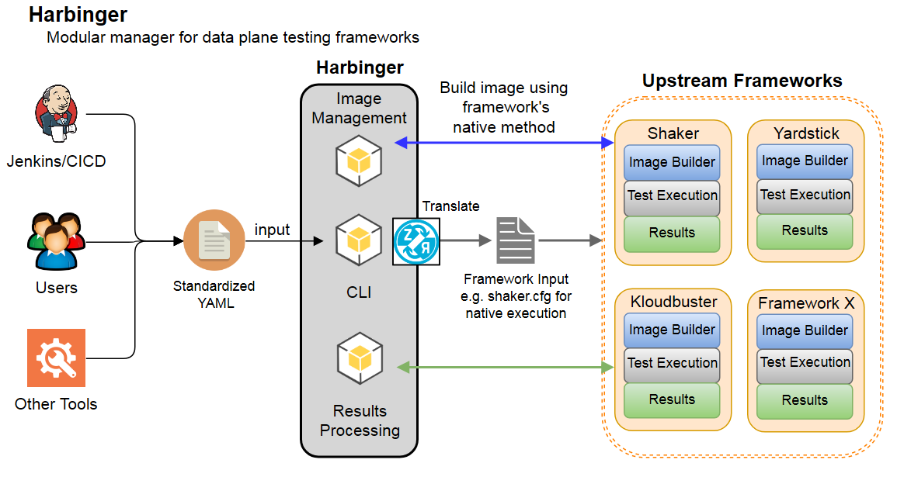

=================================================================
What is Harbinger
=================================================================

Harbinger is a modular manager for Openstack data plane testing frameworks.
It allows simultaneous execution of multiple testing frameworks by leveraging their commonalities.

The diagram below is a high level representation of where Harbinger lies within
the described workflow.

By providing a single standardized yaml file, Harbinger abstracts
away the need for the user to know the format of the input file required
for the desired framework. The user is able to run any of the supported testing frameworks.

Harbinger also provides commands to show which frameworks are supported and
can provide lists to determine what tests are provided with supported frameworks
